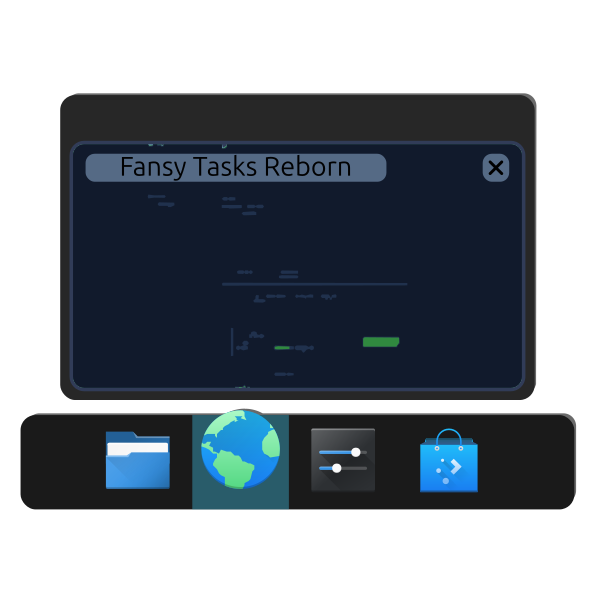

# Fancy Tasks NG



Fancy Tasks NG is a feature-rich, highly customizable taskbar-style window switcher for KDE Plasma. It brings modern aesthetics, improved animations, and deep configuration options to your desktop.

## Why this fork?

This project is a modern continuation of the Fancy Tasks plasmoid. 
It started as a fork of [FancyTasksPlus](https://github.com/SushiTrashXD/FancyTasksPlus) by SushiTrashXD, which in turn was a fork of the original [FancyTasks](https://github.com/alexankitty/FancyTasks) by alexankitty (with additional code from Luis Bocanegra).

The primary reason for creating this fork is that both the original repository and its subsequent forks have long been abandoned. They lack support for modern versions of KDE Plasma and contained numerous bugs that broke the experience on newer systems. Fancy Tasks NG breathes new life into the project by ensuring compatibility and introducing several major improvements.

## Features & Improvements

Compared to the previous versions, Fancy Tasks NG includes the following major changes:

- **Full Modern Plasma 6.5+ Compatibility**: Fully adapted for the latest KDE Plasma.
- **Russian Localization**: Full translation of the plasmoid interface and settings into Russian.
- **Reworked Tooltip System**: Completely redesigned, unified, smooth-morphing tooltips native to Plasma 6.
- **Reworked Pinned Apps Manager**: A fully redesigned interface for managing and rearranging pinned applications in the settings.
- **Hover Zoom Fixes**: Corrected and improved the icon scaling (zoom) mechanism on hover.
- **Zoom Rendering Fixes**: Fixed the display mechanism for scaled icons to eliminate visual artifacts.
- **Numerous Bug Fixes**: A huge amount of under-the-hood fixes and optimizations for a smoother experience.

*Additionally, it retains all the great features from previous versions:*
- Custom Indicators: Various styles of indicators (Dashes, Dots, Metro, Ciliora, etc.) with customizable colors.
- Animation Enhancements: Smooth transitions, growing/shrinking indicators, and desaturation of minimized tasks.
- Smart Launcher Badges: Support for unread message counts on supported application icons (e.g., KMail).

## Installation

**Note:** This plasmoid requires Qt 6 and plasma-workspace 6.5+.

### From Source

1. Clone this repository:
   ```bash
   git clone https://github.com/daydve/FancyTasksNG.git
   ```
2. Enter the directory and install using the provided script:
   ```bash
   cd FancyTasksNG
   ./install.sh
   ```
   *(If you are updating an existing installation, run `./update.sh`)*
3. Restart your Plasma session or run `plasmashell --replace > /dev/null 2>&1 & disown` to apply the new plasmoid.
4. Right-click your panel, select "Add Widgets," and search for "Fancy Tasks NG".

## Updating
To update easily from the cloned repository, simply run:
```bash
./update.sh
```
This script will compile translations, update the plasmoid via `kpackagetool6`, and gracefully restart Plasma.

## Credits & Acknowledgements

Fancy Tasks NG is built upon the great work of previous developers:
- [FancyTasksPlus](https://github.com/SushiTrashXD/FancyTasksPlus) by [SushiTrashXD](https://github.com/SushiTrashXD).
- Original [FancyTasks](https://github.com/alexankitty/FancyTasks) by [Alexandra Stone (alexankitty)](https://github.com/alexankitty).
- [Hover-zoom branch](https://github.com/luisbocanegra/FancyTasks) by [Luis Bocanegra](https://github.com/luisbocanegra).
- The original KDE Plasma Task Manager plasmoid by Eike Hein, Nate Graham, and the KDE Team.
- Additional contributions by ziomek64 and others to the original repository.

## Translation
Translations are handled via gettext `.po` files located in the `package/translate` directory. Contributions to translations are welcome via pull requests!

## Contact & Bug Reports
For bug reports, feature requests, or contributions, please use the [GitHub Issues tracker](https://github.com/daydve/FancyTasksNG/issues).

## Pictures

Colorful Tasks  


Metro  


Ciliora  


Dashes  


Dots  


Desaturate minimized tasks  


Minimized task shrinking  


