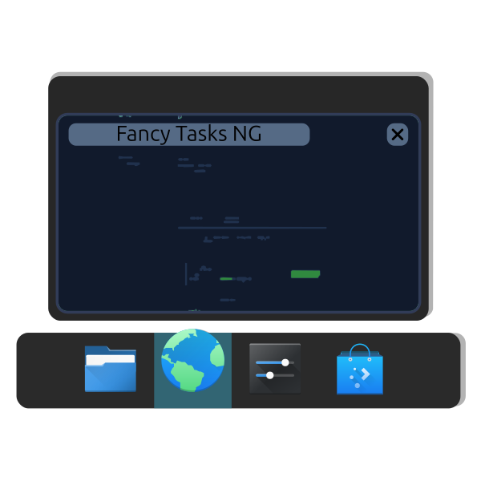
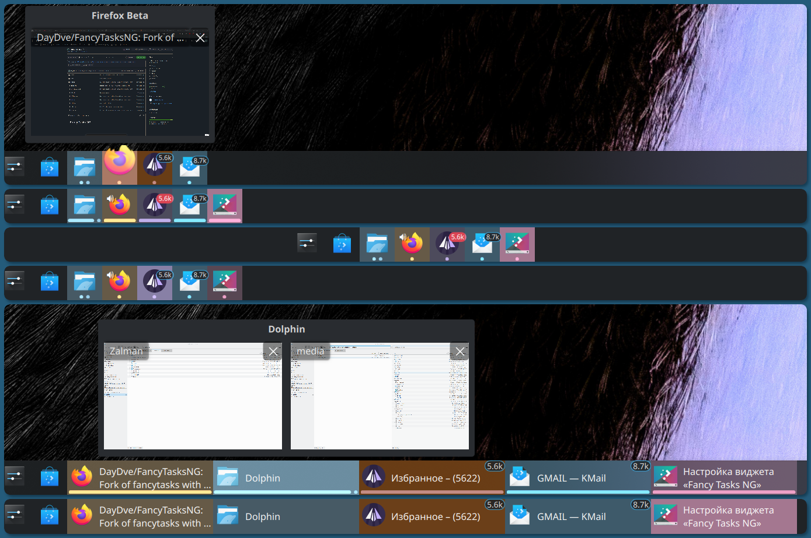

<p align="center">
  
</p>

<h1 align="center">Fancy Tasks NG</h1>

<p align="center">
  <strong>A feature-rich, deeply customizable taskbar for KDE Plasma 6 — kept alive when everyone else gave up.</strong>
</p>

<p align="center">
  <a href="https://github.com/daydve/FancyTasksNG/releases/latest">
    
  </a>
  
  
  
</p>

---



---

## What is this?

**Fancy Tasks NG** is a replacement for the default KDE Plasma task manager — the panel widget that shows your open windows and pinned application launchers.

While the stock Plasma taskbar is functional, it's plain. Fancy Tasks NG adds a layer of visual richness and configurability that power users have always wanted: animated activity indicators, unread notification badges right on the app icon, volume overlay controls, smooth hover-zoom animations, live window thumbnails in tooltips, and much more — all integrated seamlessly into the native Plasma 6 look and feel.

Think of it as the Plasma taskbar that KDE *almost* shipped, but didn't.

---

## Why this fork exists

The Fancy Tasks plasmoid has a long lineage:

1. The original **[FancyTasks](https://github.com/alexankitty/FancyTasks)** by [Alexandra Stone (alexankitty)](https://github.com/alexankitty) — a brilliant reimagination of the Plasma 5 task manager, with animated indicators and badge support.
2. **[FancyTasksPlus](https://github.com/SushiTrashXD/FancyTasksPlus)** by [SushiTrashXD](https://github.com/SushiTrashXD) — an initial port to Plasma 6.2, carrying the torch when the original was abandoned.
3. **Fancy Tasks NG** (this project) — a complete modernization for **Plasma 6.5 and beyond**, started when FancyTasksPlus itself went unmaintained, leaving users on modern systems with a broken, glitchy widget.

Both predecessor projects were abandoned, and the collective effort of their contributors risked being lost. **Fancy Tasks NG** was created to ensure that this functionality — which simply doesn't exist anywhere else in the Plasma ecosystem — continues to work correctly on current systems and keeps improving.

---

## Features

While preserving and completely reimplementing the best concepts from its predecessors, Fancy Tasks NG introduces a wealth of original features and deep architectural improvements built specifically for the modern Plasma 6.5+ ecosystem.

- **Full Plasma 6.5+ compatibility** — rebuilt from the ground up against modern Plasma APIs; no hacks, no workarounds
- **Two display modes** — classic panel (icons + labels) or icon-only mode
- **Centered icon alignment** — perfectly center your taskbar icons on the panel for a cleaner, modern look
- **Activity indicators** — Line and Dashes styles; configurable color (plasma accent, dominant icon color, or custom), thickness, length, roundness, position, edge offset, max segment count, and animation
- **Hover zoom** — icons grow on hover in icon-only mode; configurable zoom amount and animation duration
- **Task button coloring** — colorize task button backgrounds using the dominant icon color or a custom color
- **Reworked tooltip system** — smooth-morphing tooltips native to Plasma 6, with live window thumbnails, media controls, and window highlight on hover
- **Unified grouped-task tooltips** — consistent tooltip appearance for grouped windows regardless of thumbnail settings
- **Reworked pinned app manager** — redesigned settings interface for managing and reordering pinned launchers
- **Smart launcher badges** — unread message counters appear directly on app icons (KMail, Telegram, and other supported apps)
- **Volume overlay controls** — configurable mouse-wheel action to adjust window volume; Shift to adjust system volume instead; optional second action on Ctrl+wheel
- **Progress overlays** — in-progress tasks (e.g. file copies) show a progress bar directly on the icon
- **Desaturate minimized task indicators** — activity indicators fade to grayscale for minimized windows to help active apps stand out
- **Close animation** — particle explosion effect when closing an application with a middle-click (icon-only mode)
- **Configurable middle-click** — close, open new window, minimize/restore, toggle grouping, or bring to current desktop
- **Multi-row / multi-column layout** — configurable number of rows (or columns on vertical panels)
- **Plasma 6.6 compatibility** — fixed tooltip visibility, icon clipping, and highlight rendering regressions
- **Russian localization** — full translation of the widget UI and all settings pages
- **Full Wayland support**
- **And much more...** — dozens of small tweaks and options to make the taskbar truly yours

---

## Requirements

- **KDE Plasma** 6.5 or newer
- **Qt** 6
- **Python** 3 (with `python3-dbus` and `python3-gi` for backend features)
- **kpackagetool6** (part of the standard `plasma-workspace` package)

---

## Installation

### From source (recommended)

```bash
# 1. Clone the repository
git clone https://github.com/daydve/FancyTasksNG.git
cd FancyTasksNG

# 2. Build translations and install the plasmoid
make install
```

Then right-click your panel → **Add Widgets** → search for **"Fancy Tasks NG"**.

### From a pre-built package

Download the latest `FancyTasksNG.plasmoid` from the [Releases page](https://github.com/daydve/FancyTasksNG/releases) and install it via:

```bash
kpackagetool6 -t Plasma/Applet --install FancyTasksNG.plasmoid
```

### From KDE Store

The widget is also available on [KDE Store](https://store.kde.org/p/2350434) and can be installed directly from the **Get New Widgets** dialog in Plasma (right-click the panel → **Add Widgets** → **Get New Widgets**).

> **Note:** The KDE Store release may lag behind the GitHub releases. For the latest version, install from source or a pre-built package from the [Releases page](https://github.com/daydve/FancyTasksNG/releases).

---

## Updating

If you installed from source, pull the latest changes and run:

```bash
git pull
make update
```

`make update` compiles translations, upgrades the installed plasmoid package, and **automatically restarts Plasma** — no manual steps needed.

> **Note:** Use `make update` for updates, not `make install`.

---

## Uninstallation

Remove all running plasmoid instances first, then run:

```bash
make uninstall
```

---

## Other Makefile commands

| Command | Description |
|---|---|
| `make build` | Package the plasmoid into a `.plasmoid` file in `release/` |
| `make test` | Run the plasmoid in a standalone `plasmawindowed` instance for development testing |
| `make translate` | Extract new translatable strings and compile existing translations |
| `make clean` | Remove build artifacts and compiled translation files |

---

## Contributing

Bug reports, feature requests, and pull requests are welcome via the [GitHub Issues tracker](https://github.com/daydve/FancyTasksNG/issues).

### Translations

Translation files are `.po` gettext files located in `tools/translate/`. To contribute a translation, edit the appropriate `.po` file and submit a pull request.

---

## Credits & Acknowledgements

Fancy Tasks NG stands on the shoulders of everyone who came before:

| Project | Author | Contribution |
|---|---|---|
| [FancyTasksPlus](https://github.com/SushiTrashXD/FancyTasksPlus) | [SushiTrashXD](https://github.com/SushiTrashXD) | Plasma 6 initial port — the direct upstream of this fork |
| [FancyTasks](https://github.com/alexankitty/FancyTasks) | [Alexandra Stone (alexankitty)](https://github.com/alexankitty) | Original Plasma 5 reimplementation with indicators and badges |
| [Hover-zoom branch](https://github.com/luisbocanegra/FancyTasks) | [Luis Bocanegra](https://github.com/luisbocanegra) | Hover zoom implementation |
| KDE Plasma Task Manager | Eike Hein, Nate Graham, KDE Team | The original upstream task manager that everything is built upon |
| — | ziomek64 and other contributors | Contributions to the original FancyTasks repository |

---

<p align="center">
  <sub>Licensed under GPL-3.0-or-later &nbsp;·&nbsp; Maintained by <a href="https://github.com/daydve">Vitaliy Elin</a></sub>
</p>
